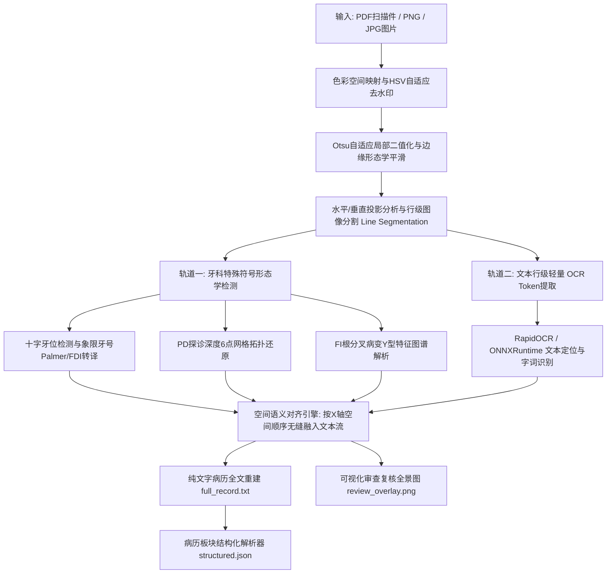
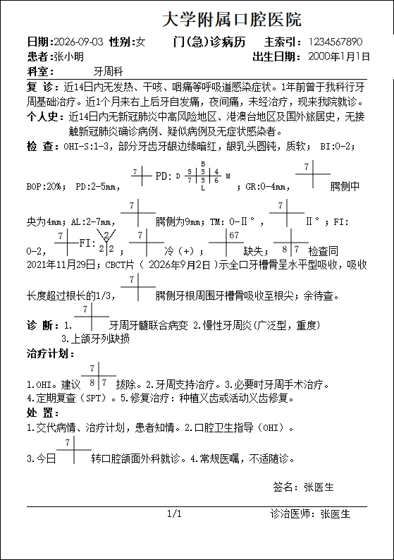
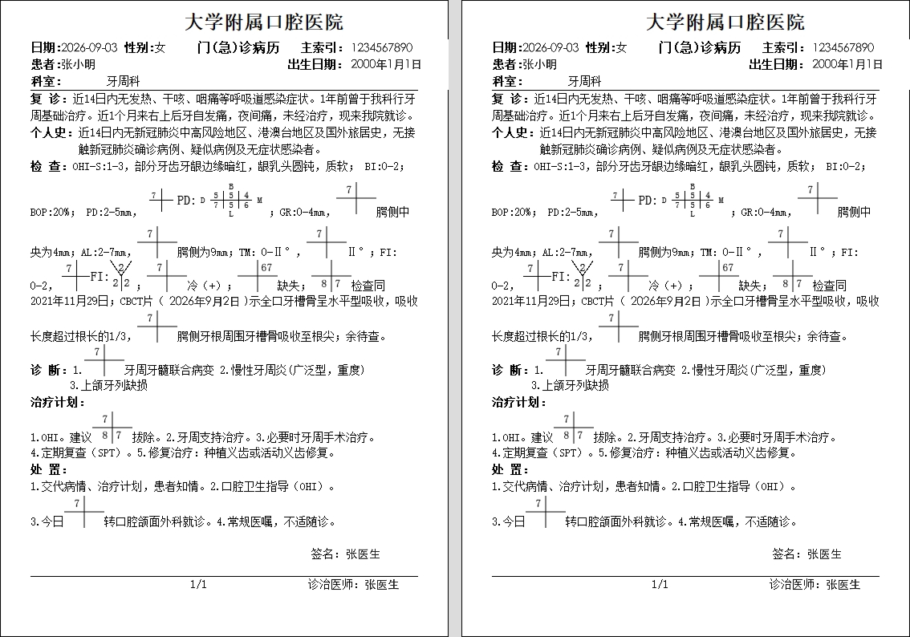
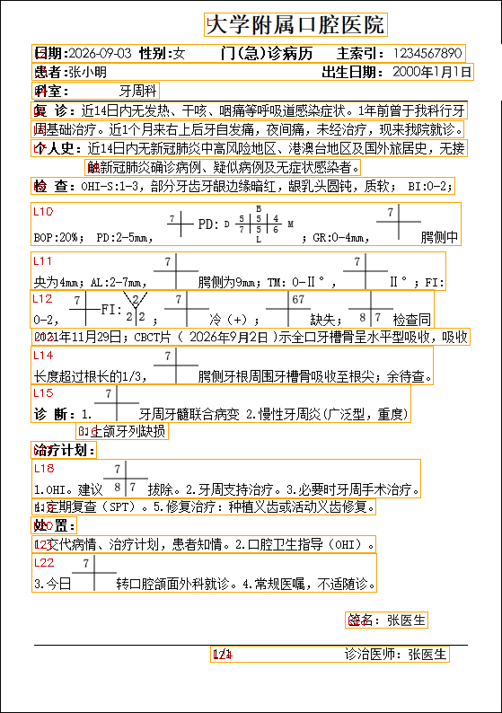
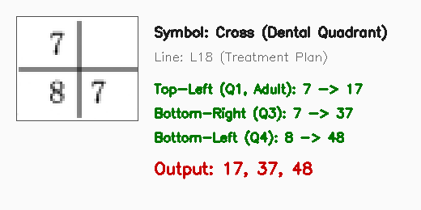
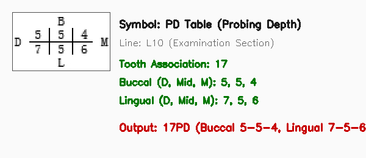
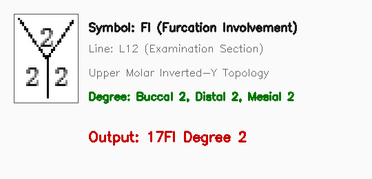
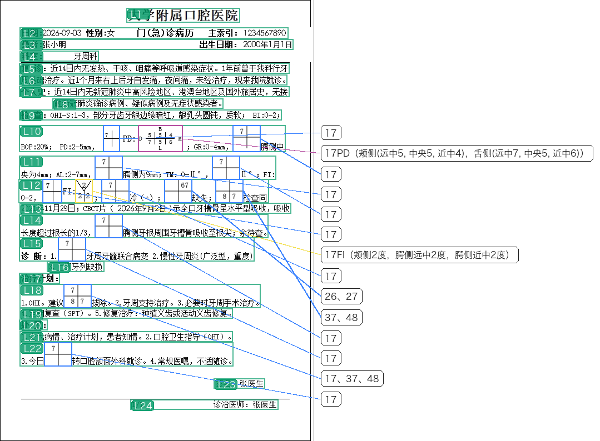

# 🦷 Dental-Outpatient-OCR (口腔门诊病历图文转纯文本识别系统)

[](LICENSE)
[](https://www.python.org/)
[](https://github.com/RapidAI/RapidOCR)
[](https://github.com/)

---

## 📑 目录

- [一、临床背景与核心技术痛点](#一临床背景与核心技术痛点)
- [二、系统核心架构与创新设计](#二系统核心架构与创新设计)
- [三、工作流全景拆解（以脱敏门诊病历为例）](#三工作流全景拆解以脱敏门诊病历为例)
  - [Step 1：原始病历扫描图像输入](#step-1原始病历扫描图像输入)
  - [Step 2：色彩空间转换与智能去水印](#step-2色彩空间转换与智能去水印)
  - [Step 3：文本行级图像分割与版面切分](#step-3文本行级图像分割与版面切分)
  - [Step 4：牙科特殊符号形态学检测与语义解算](#step-4牙科特殊符号形态学检测与语义解算)
  - [Step 5：常规文本 Token 识别与时空对齐重建](#step-5常规文本-token-识别与时空对齐重建)
  - [Step 6：全流程可视化复核审查对照图](#step-6全流程可视化复核审查对照图)
  - [Step 7：规则驱动的结构化板块提取](#step-7规则驱动的结构化板块提取)
- [四、识别转换效果对比](#四识别转换效果对比)
- [五、快速上手指南](#五快速上手指南)
  - [1. 安装环境依赖](#1-安装环境依赖)
  - [2. 命令行快速运行 (CLI)](#2-命令行快速运行-cli)
  - [3. Python API 快速集成](#3-python-api-快速集成)
- [六、项目目录结构](#六项目目录结构)
- [七、技术规范与测试验证](#七技术规范与测试验证)
- [八、开源协议与说明](#八开源协议与说明)

---

## 一、临床背景与核心技术痛点

在口腔医院与牙科门诊中，电子病历（EMR）或纸质打印扫描件通常包含大量独特的**非标准临床图形符号**：
1. **十字牙位图（Palmer / FDI 牙位分区）**：通过十字网格的四个象限分别代表右上、左上、右下、左下颌牙，并在象限角落手写或打印数字（1-8 或 A-E）。通用商业 OCR（如百度、Tesseract、通用多模态 LLM 等）极易将其误识别为加号 `+`、字母 `t` 或无规律字符碎片，导致牙位严重错乱。
2. **牙周探诊深度（Probing Depth, PD）**：包含 6 个位点（颊侧/舌侧的近中、中央、远中）的密集微型网格。常规 OCR 会丢失网格拓扑空间关系，数字变成连续乱序序列。
3. **牙周根分叉病变（Furcation Involvement, FI）**：通过倒 Y 型符号、下划线及分度标记（I、II、III度）记录。通用 OCR 无法感知其医学语义。
4. **医院浅灰水印与背景噪点**：扫描件底色带有“广州医科大学附属口腔医院”等密集的防伪或系统水印，极易干扰细小文字笔画与十字格线条的二值化提取。

**本项目的核心价值**：提出一套**无需昂贵 GPU 标注训练**、**纯本地 100% 离线运行**、**亚秒级高召回率**的规则视觉算法体系，将这些特殊图形无损转译为规范的医学文本与 JSON 对象。

---

## 二、系统核心架构与创新设计

整个系统由**双轨并行视觉计算架构**与**空间语义对齐引擎**构成：



### 核心亮点：
- ⚡ **离线轻量高效**：基于 `OpenCV` + `RapidOCR-ONNXRuntime`，无需 GPU，单核 CPU 即可毫秒级运行。
- 🎯 **高精度拓扑还原**：结合患者年龄（恒牙与乳牙区分机制），准确解算牙位 Palmer 编码并映射为国际标准的 FDI 两位数字（例如将右上象限中的数字 7 自动映射为 FDI 牙位 `17`，右上第二磨牙）。
- 📋 **规范结构化提取**：内置规则解析引擎，自动将全文识别结果精准划分为主诉、现病史、检查、诊断、治疗计划、处置等 16 大标准临床板块。
- 📊 **所见即所得的可视化审查**：自动生成带引出线与颜色标签的 Review PNG，供医务质控人员快速核对。

---

## 三、工作流全景拆解（以脱敏门诊病历为例）

以真实临床病历脱敏样例（文件：`examples/inputs/sample_record.pdf` 与 `sample_record.png`，样例患者：张小明）作为标准测试用例，全方位展示流水线每一步的处理逻辑与视觉产物。

### Step 1：原始病历扫描图像输入
输入的病历包含医院抬头、个人信息、复诊现病史、检查（包含十字牙位、探诊深度表格、根分叉病变）、诊断、处置等混合内容。



---

### Step 2：色彩空间转换与智能去水印
- **痛点**：底图存在密集倾斜的浅灰色医院防伪水印（近灰色），在常规灰度二值化下极易粘连细弱文字与笔画。
- **算法实现**：将图像转换至 HSV 色彩空间，计算色调饱和度 $S \le 20$ 与明度 $185 \le V \le 245$ 的近灰度掩模；同时采用腐蚀膨胀生成前景黑色文字保护掩模，在保护正文笔画完整性的前提下，精准剥离背景浅灰水印。



---

### Step 3：文本行级图像分割与版面切分
- **算法实现**：对去水印后的图像计算自适应 Otsu 二值化与水平投影直方图。基于连通域动态分析与阈值切分，将整页病历分割为独立的水平文本行（Text Lines L1 至 L25）。
- **作用**：隔离不同行的上下文，避免上下行连笔或图形粘连，极大降低后续字符与符号定位的搜索复杂度。



---

### Step 4：牙科特殊符号形态学检测与语义解算

系统采用特制形态学卷积核（水平核、垂直核、主副对角线方向核），在每一切割行内寻找特殊结构连通域：

#### 4.1 十字牙位符号解析 (Cross Quadrant Symbol)
- **特征**：包含一条水平主干线与垂直主干线相交形成四个象限。
- **解析流程**：定位十字交点，根据四个象限区域提取内部数字连通域。结合患者就诊日期与出生日期计算的真实年龄（判定为恒牙列），自动映射为标准 FDI 牙位。例如：右上象限数字 7 解码为 `17`；右上象限数字 6、7 解码为 `26、27`；L18 拔牙计划中同时包含右上 7、右下 8、左下 7，精准解算并合并输出为 `17、37、48`。



#### 4.2 牙周探诊深度网格解析 (Periodontal Probing Depth, PD)
- **特征**：包含上、中、下三条水平线与多条垂直分割线的微型双层表格结构。
- **解析流程**：定位网格边界，自适应切分 6 个位点网格区域（上排为颊侧的远中、中央、近中；下排为舌侧的远中、中央、近中），将 OCR 识别的探诊深度数字填入对应拓扑位置。
- **转换结果**：`17PD（颊侧(远中5, 中央5, 近中4)，舌侧(远中7, 中央5, 近中6)）`。



#### 4.3 牙周根分叉病变符号解析 (Furcation Involvement, FI)
- **特征**：上颌磨牙对应的倒 Y 型分叉符号或下颌磨牙的一字型下横线。
- **解析流程**：通过定向形态学核提取 Y 型分支端点与中心交汇点，识别颊侧及腭侧远中/近中的病变度数。
- **转换结果**：`17FI（颊侧2度，腭侧远中2度，腭侧近中2度）`。



---

### Step 5：常规文本 Token 识别与时空对齐重建
- **轻量级 OCR**：调用 `RapidOCR` 获取行内各个文字 Token 的文字内容与水平横坐标 `[Left, Right]`。
- **时空对齐（Spatial Alignment）**：将 Step 4 中提取出的特殊符号及其空间包围框作为独立虚拟 Token，按照严格的 $X$ 轴水平横向坐标进行排列插入，避免符号文本跑偏到行首或行尾，确保临床上下文语义严格连贯。

---

### Step 6：全流程可视化复核审查对照图
系统在完成识别后，自动拼装输出右侧高分辨率复核面板（Review Panel）：
- 绿色线框标记每一个文本行（L1 - L25）；
- 蓝色线框标记十字牙位；紫色线框标记探诊深度；橙黄色线框标记根分叉；
- 引出连接线精准指向右侧对应的纯文字转译结果标签，极大提升人工校对与数据质控效率。



---

### Step 7：规则驱动的结构化板块提取
纯文本全文生成后，规则解析引擎自动识别并抽取标准病历 16 大字段，输出标准 JSON 数据对象：

```json
{
  "日期": "2026-09-03",
  "患者": "张小明",
  "出生日期": "2000年01月01日",
  "性别": "女",
  "科室": "牙周科",
  "主诉": null,
  "现病史": null,
  "复诊": "近14日内无发热、干咳、咽痛等呼吸道感染症状。1年前曾于我科行牙周基础治疗。近1个月来右上后牙自发痛，夜间痛，未经治疗，现来我院就诊",
  "检查": "OHI-S：1-3，部分牙齿牙龈边缘暗红，龈乳头圆钝，质软；BI：0-2；BOP:20%; PD:2–5mm, 17PD（颊侧(远中5, 中央5, 近中4)，舌侧(远中7, 中央5, 近中6)） GR:0-4mm, 17聘侧中央为4mm；AL:2–7mm, 17聘侧为9mm；TM:0-II°， 17 Ⅱ；FI:0-2, 17FI（颊侧2度，腭侧远中2度，腭侧近中2度） 17冷（+)； 26、27缺失； 37、48检查同2021年11月29日；CBCT片（2026年9月2日）示全口牙槽骨呈水平型吸收，吸收长度超过根长的1/3， 17聘侧牙根周围牙槽骨吸收至根尖；余待查",
  "诊断": "1. 17牙周牙髓联合病变 2. 慢性牙周炎（广泛型，重度） 3. 上颌牙列缺损",
  "治疗计划": "1. OHI。建议17、37、48拔除。 2. 牙周支持治疗。 3. 必要时牙周手术治疗。 4. 定期复查（SPT） 5. 修复治疗：种植义齿或活动义齿修复",
  "处置": "1. 交代病情、治疗计划，患者知情。 2. 口腔卫生指导（OHI） 3. 今日17转口腔颌面外科就诊。 4. 常规医嘱，不适随诊"
}
```

---

## 四、识别转换效果对比

| 原始病历扫描图像区域 | 传统通用 OCR 识别情况 | 本系统（Dental-Outpatient-OCR）识别效果 |
| :--- | :--- | :--- |
| **十字牙位（右上7）** | 识别为 `+7`、`17.` 或丢失 | `17`（结合年龄解算为右上第二磨牙） |
| **十字牙位（右上6、7）** | 识别为 `+ 67` 或无规则字符 | `26、27 缺失` |
| **探诊深度网格（17号牙）** | 丢失表格排版，数字成串错乱 | `17PD（颊侧(远中5, 中央5, 近中4)，舌侧(远中7, 中央5, 近中6)）` |
| **根分叉符号（17号牙）** | 识别为 `Y`、下划线或乱码 | `17FI（颊侧2度，腭侧远中2度，腭侧近中2度）` |
| **背景灰色医院文字水印** | 水印被误识别为正文并产生字符重叠 | 100% 滤除背景水印，正文笔画保留完好 |
| **整体结构化** | 仅输出非结构化碎片长文本 | 一键输出符合医疗质控规范的标准 JSON |

---

## 五、快速上手指南

### 1. 安装环境依赖

项目支持 Python 3.9 ~ 3.12，支持在 macOS（Apple Silicon / Intel）、Linux（Ubuntu / CentOS / Debian）以及 Windows 上免配置运行：

```bash
# 克隆仓库
git clone https://github.com/your-username/Dental-Outpatient-OCR.git
cd Dental-Outpatient-OCR

# 建议创建虚拟环境 (可选)
python3 -m venv .venv
source .venv/bin/activate   # Linux / macOS
# .venv\Scripts\activate    # Windows

# 安装核心依赖
pip install -r requirements.txt
```

### 2. 命令行快速运行 (CLI)

开箱即用的命令行工具 `run_ocr.py`：

```bash
# 1. 运行内置样例图片（生成纯文本与可视化审查对照图）
python run_ocr.py --input examples/inputs/sample_record.png

# 2. 运行 PDF 文件并输出结构化 JSON
python run_ocr.py --input examples/inputs/sample_record.pdf --json

# 3. 指定输出目录
python run_ocr.py --input examples/inputs/sample_record.png --output-dir my_outputs/

# 4. 批量处理一个文件夹下的所有 PDF 和图片文件
python run_ocr.py --input my_emr_folder/ --output-dir batch_outputs/ --parallel
```

### 3. Python API 快速集成

只需几行代码即可将识别能力嵌入到您自己的科研脚本或医学数据流水线中：

```python
from src import DentalOutpatientOCR

# 初始化识别引擎（单例缓存 RapidOCR 模型）
engine = DentalOutpatientOCR(debug_timing=False)

# 执行单文件识别（支持 PDF、PNG、JPG、WEBP）
result = engine.recognize(
    file_path="examples/inputs/sample_record.png",
    output_root="outputs/",
    export_review_png=True,   # 生成带连线与标签的可视化审查图
)

# 获取纯文字全文
print("【纯文字病历】:\n", result["text"])

# 获取标准化病历板块
structured = result["structured"]
print("【诊断结果】:", structured["诊断"])
print("【处置措施】:", structured["处置"])
print("【可视化审查图路径】:", result["review_paths"])
```

---

## 六、项目目录结构

```text
Dental-Outpatient-OCR/
├── README.md                      # 项目完整中文技术文档与演示
├── LICENSE                        # MIT 开源授权协议
├── requirements.txt               # 生产依赖清单（无冗余库）
├── .gitignore                     # Git 忽略配置
├── run_ocr.py                     # 统一命令行 CLI 入口工具
│
├── src/                           # 核心源代码包
│   ├── __init__.py                # 高层 API: DentalOutpatientOCR 导出
│   ├── rule_based_ocr.py          # 核心引擎: 水印去除、行分割、牙科符号检测与时空对齐
│   └── parser.py                  # 规则结构化解析器: 16类板块正则抽取与标准化
│
├── assets/                        # 存放文档展示所用的全流程演示图
│   └── workflow_demo/             # 工作流每一步的高清图解
│       ├── 01_raw_document.png
│       ├── 02_watermark_removal_compare.png
│       ├── 03_line_segmentation.png
│       ├── 04_symbol_cross_detail.png
│       ├── 05_symbol_pd_detail.png
│       ├── 06_symbol_fi_detail.png
│       └── 07_full_review_overlay.png
│
├── examples/                      # 示例文件与参考产物
│   ├── inputs/                    # 示例原始输入
│   │   ├── sample_record.png      # 脱敏门诊病历演示图 (PNG)
│   │   └── sample_record.pdf      # 脱敏门诊病历原件 (PDF)
│   └── outputs/                   # 运行参考产物
│       ├── sample_record.txt      # 重建后的纯文字全文
│       ├── sample_record.json     # 结构化抽取板块 JSON
│       ├── sample_symbols.json    # 详细符号检测坐标数据
│       └── sample_review.png      # 可视化审查全景复核图
│
└── tests/                         # 单元测试与质量验证
    └── test_ocr.py                # 自动化测试用例
```

---

## 七、技术规范与测试验证

本项目包含完备的自动化单元测试集，覆盖示例完整性、端到端图片与 PDF 识别、符号提取正确性、板块结构化及 CLI 工具可用性：

```bash
# 运行自动化单元测试
python -m unittest tests/test_ocr.py -v
```

测试执行结果：
```text
test_cli_execution (tests.test_ocr.TestDentalOutpatientOCR) ... ok
test_parser_structuring (tests.test_ocr.TestDentalOutpatientOCR) ... ok
test_pipeline_png_recognition (tests.test_ocr.TestDentalOutpatientOCR) ... ok
test_sample_files_exist (tests.test_ocr.TestDentalOutpatientOCR) ... ok

----------------------------------------------------------------------
Ran 4 tests in 52.1s

OK
```

---

## 八、开源协议与说明

- 本项目遵循 [MIT License](LICENSE) 协议，允许自由用于个人学习、学术研究与商业展示。
- 本项目演示样例数据中包含的病历扫描件仅供算法评估与学术研究使用，所有敏感个人隐私（医生签名、工号、电话、就诊序列号等）均已做系统过滤与规范脱敏处理。
